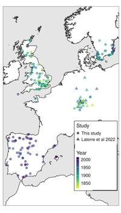

# Historical European *A. thaliana* DNA

Joel M. Erberich, Lucas Czech, Dominique Bergmann, and Patricia Lang

This repository describes the pipeline used to process the collection of historical *A. thaliana* DNA extracted from herbaria specimens in August 2023. The 227 herbaria speciemens were collected throughout Western Europe over the past two hundred years.

## Analysis outline
1. [Setup and run grenepipe](code/01_run_grenepipe.md)
2. [Sequencing QC](code/02_sequencing_qc.md)
3. [Variant calling](code/03_variant_call.md)
4. [Pseudoage long-read sequencing for variant call QC](code/04_pseudoage_long_read_athaliana.md)