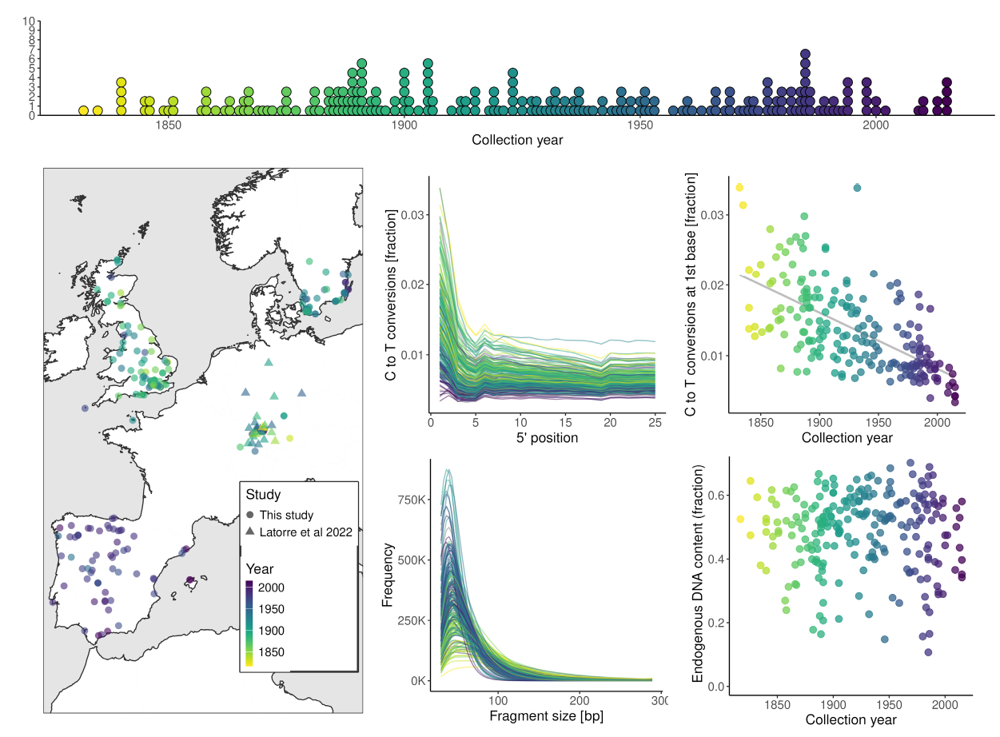

# Historical European *A. thaliana* DNA processing

Joel M. Erberich, Lucas Czech, Dominique Bergmann, and Patricia Lang

This repository describes the pipeline used to process the collection of historical *Arabidopsis thaliana* DNA extracted from herbaria specimens in July 2023 at the UCSC Paleogenomics Lab. The 235 herbaria speciemens were collected throughout Western Europe over the past two hundred years. After filtering, 215 were retained and added to 30 more previously sequenced samples from Germany. Pipeline was ran on the SCG HPC cluster at Stanford University, Calc HPC cluster at Carnegie Institution of Science, and BRC HPC cluster at University of California, Berkeley. We thank Sergio Latorre and Hernán Burbano for their reccomendation to use gargammel and their [long-read variant call validation pipeline](https://github.com/Burbano-Lab/rice-blast-variant-calling/) to test our VCF filters.

**Collection of herbarium A. thaliana accessions.** Temporal distribution of the samples colored by the year collected. Geographical distribution of samples colored by year collected. Circles are samples sequenced for this dataset. Triangles are previously sequenced in Latorre et al 2022. Fraction of nucleotides that underwent a C to T conversion by 5’ read position. This is a result of UV damage over time. Fragment ends are more likely to deaminate under UV radiation. Fraction of nucleotides deanimated on the 5’ 1st base by the collection year. Linear regression shows significant negative correlation between conversion fraction and year collected as expected as older samples underwent more UV radiation. Frequency of fragment size. Each sample’s distribution is represented by a line colored by year collected. Ultra short fragment size is a hallmark of historical DNA samples due to low quality storage and age-associated fragmentation of longer strands. Endogenous DNA fraction over collection year. Mean of 0.51 is represented by a dashed line. No correlation suggests that posthumous infections are not more likely with age and are sample specific.

## Analysis outline
1. [Setup and run grenepipe](code/01_run_grenepipe.md)
2. [Sequencing QC](code/02_sequencing_qc.md)
3. [Variant calling](code/03_variant_call.md)
4. [Pseudoage long-read sequencing for variant call QC](code/04_pseudoage_long_read_athaliana.md)

### Supporting packages and references
| Name | Source |
| ----------- | ----------- |
| *A. thaliana* TAIR10 genome | [https://www.arabidopsis.org](https://www.arabidopsis.org/download/list?dir=Genes%2FTAIR10_genome_release%2FTAIR10_chromosome_files) |
| High-quality *A. thaliana* genomes | [Lian et al. 2024](https://doi.org/10.1038/s41588-024-01715-9) |
| Historical German *A. thaliana* genomes | [Latorre et al. 2022](https://doi.org/10.5281/zenodo.7156189) |
| Grenepipe (v0.13.0) | [https://github.com/moiexpositoalonsolab/grenepipe/wiki](https://github.com/moiexpositoalonsolab/grenepipe/wiki) |
| AdapterRemoval (v2.3) | [https://adapterremoval.readthedocs.io/en/2.3.x](https://adapterremoval.readthedocs.io/en/2.3.x/) |
| Bwa Mem (v0.7.18) | [https://github.com/lh3/bwa](https://github.com/lh3/bwa) |
| minimap2 (v2.28) | [https://github.com/lh3/minimap2](https://github.com/lh3/minimap2) |
| Samtools (v1.21) | [https://github.com/samtools/samtools](https://github.com/samtools/samtools) |
| DeDup (v0.12.8) | [https://github.com/apeltzer/DeDup](https://github.com/apeltzer/DeDup) |
| MapDamage (v2.0) | [https://ginolhac.github.io/mapDamage](https://ginolhac.github.io/mapDamage/) |
| bedtools (v2.31.0) | [https://bedtools.readthedocs.io/en/latest/index.html](https://bedtools.readthedocs.io/en/latest/index.html) |
| BCFtools (v1.10.2) | [https://samtools.github.io/bcftools](https://samtools.github.io/bcftools/) |
| VCFtools (v0.1.16) | [https://github.com/vcftools/vcftools](https://github.com/vcftools/vcftools) |
| PLINK (v2.0) | [https://www.cog-genomics.org/plink/2.0](https://www.cog-genomics.org/plink/2.0/) |
| GATK (v4.5.0.0) | [https://github.com/broadinstitute/gatk](https://github.com/broadinstitute/gatk) |
| R (v4.4.0) | [https://www.r-project.org](https://www.r-project.org/) |
| dplyr (v1.1.4) | [https://dplyr.tidyverse.org](https://dplyr.tidyverse.org/) |
| ggplot2 (v3.5.1) | [https://ggplot2.tidyverse.org](https://ggplot2.tidyverse.org/) |
| scales (v1.3.0) | [https://scales.r-lib.org](https://scales.r-lib.org/) |
| gargammel | [https://github.com/grenaud/gargammel](https://github.com/grenaud/gargammel) |
