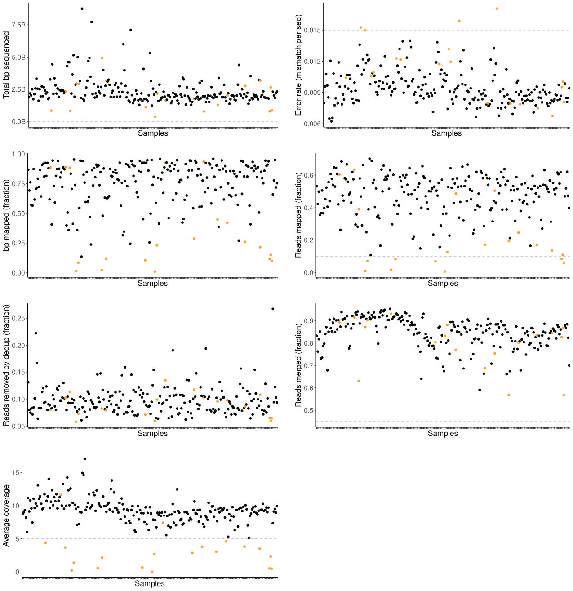

# Historical European *A. thaliana* DNA processing
## Sequencing QC

### Generate summary statistics
Make directory for stats
```bash
mkdir /path/to/grenepipe/output/stats/
```

Merging from adaptorremoval
```bash
cd /path/to/grenepipe/output/trimming
find . -name "*.settings" | xargs -i bash -c 'BASE=$(echo $1 | cut -d "." -f 2 | sed "s/\///" | sed "s/-1//"); notPAIRED=$(cat $1 | grep "full-length collapsed" | cut -d ":" -f 2); allPAIRS=$(cat $1 | grep "Total number of read pairs" | cut -d ":" -f 2); bpRETAINED=$(cat $1 | grep "Number of retained nucleotides" | cut -d ":" -f 2); echo $BASE $notPAIRED $allPAIRS $bpRETAINED' -- {} > /path/to/grenepipe/output/stats/erberich_trimmed_stats_merged
```

Mapping from samtools stats
```bash
cd /path/to/grenepipe/output/qc/samtools-stats
ls *txt | xargs -i bash -c 'PERC=$(cat $1 | grep ^SN | egrep "total length|cigar\):" | sed -E "s/^.*:\s+([0-9]+).*$/\1/" | tr "\n" "\t" | awk "{print (\$2/\$1)*100}"); MAP=$(cat $1 | grep ^SN | egrep "cigar\):" | sed -E "s/^.*:\s+([0-9]+).*$/\1/"); UNMAP=$(cat $1 | grep ^SN | egrep "total length" | sed -E "s/^.*:\s+([0-9]+).*$/\1/"); MIS=$(cat $1 | grep ^SN | egrep "mismatches:" | sed -E "s/^.*:\s+([0-9]+).*$/\1/"); ERR=$(cat $1 | grep ^SN | egrep "error rate:" | awk "{print \$4}"); UNREADS=$(cat $1 | grep ^SN | egrep "reads unmapped:" | sed -E "s/^.*:\s+([0-9]+).*$/\1/"); READS=$(cat $1 | grep ^SN | egrep "reads mapped:" | sed -E "s/^.*:\s+([0-9]+).*$/\1/"); FRAGLEN=$(cat $1 | grep ^SN | egrep "average length:" | sed -E "s/^.*:\s+([0-9]+).*$/\1/"); echo $1 $MAP $UNMAP $UNREADS $PERC $MIS $ERR $READS $FRAGLEN' -- {} > /path/to/grenepipe/output/statsstats/erberich_mapstats_reads
```

Deduplication from dedup
```bash
ls /path/to/grenepipe/output/mapping/dedup/*.log | xargs -i bash -c 'NAME=$(echo $1 | cut -d "/" -f 11 | sed "s/.filtered.log//"); READS=$(cat $1 | grep "Total" | sed -E "s/^.*:\s+([0-9]+).*$/\1/" | tr "\n" "\t"); echo $NAME $READS ' -- {} > /path/to/grenepipe/output/stats/erberich_dedup_reads
```

Damage from mapdamage
```bash
cd /path/to/grenepipe/output/damage/mapdamage
find ./*/ -name "*5p*" | xargs -i bash -c 'NAME=$(echo $1 | cut -d "/" -f 2 | sed s/results_//g | sed s/_rmdup//g); awk "NR!=1 {print \"$NAME\t\"\$1\"\t\"\$2 }" $1' -- {} > /path/to/grenepipe/output/stats/erberich_damage_CtoT

find ./*/ -name "*3p*" | xargs -i bash -c 'NAME=$(echo $1 | cut -d "/" -f 2 | sed s/results_//g | sed s/_rmdup//g); awk "NR!=1 {print \"$NAME\t\"\$1\"\t\"\$2 }" $1' -- {} > /path/to/grenepipe/output/stats/erberich_damage_GtoA
```

Fragmentation from samtools view
```bash
cd /path/to/grenepipe/output/mapping/dedup
ls *.bam | xargs -P 20 -i bash -c 'BASE=$(basename $1 | sed "s/.sorted_rmdup//"); samtools view $1 -F 4 -b | samtools sort - | samtools view - | less -S | LC_ALL=C awk "{print length(\$10)}" | sort -n | uniq -c > ${BASE}.fragcount' -- {}

#bring output of fragcounts into one file to plot in R
ls *.bam.fragcount | xargs -i bash -c 'NAME=$(echo $1 | cut -d "." -f 1,2 | sed "s/-1.bam//"); awk "{print \"$NAME\t\"\$2\"\t\"\$1}" $1' -- {} >> /path/to/grenepipe/output/stats/erberich_dedup_fragcounts

#these files are rather big, thus removing them after generating the statistics summary
rm *fragcount
```

Coverage from bedtools
```bash
cd /path/to/grenepipe/output/mapping/dedup
ls *.bam | xargs -i bash -c 'NAME=$(echo $1 | sed "s/.bam//"); COVERAGE=$(path/to/bedtools genomecov -ibam $1 | awk '\''$1 == "genome" {sum+=$2*$3;} END {print sum/119667750;}'\''); echo $NAME $COVERAGE ' -- {} > /path/to/grenepipe/output/stats/erberich_bedtools_coverage
```
### Combine and plot
Import libraries and datasets
```R
library(dplyr)
library(ggplot2)
library(scales)

# Path to stats files
loc <- c("/path/to/grenepipe/output/stats/")
# File prefix
file <- c("erberich_")


mapstats <- read.delim(paste0(loc, file, "mapstats_reads"), 
                              sep = " ", 
                              header = F, 
                              col.names = c("sample", 
                                            "bp_mapped", 
                                            "bp_seq", 
                                            "reads_seq", 
                                            "perc_mapped", 
                                            "bp_mismatch", 
                                            "error_rate", 
                                            "reads_mapped", 
                                            "average_length")) 

dedup <- read.delim(paste0(loc, file, "dedup_reads"), 
                           sep = " ", 
                           header = F, 
                           col.names = c("sample", 
                                         "reads_total",
                                         "reads_dedup")) %>% 
  filter(is.na(reads_total) == F) %>% 
  mutate(sample = gsub('.log','',sample))

merged <- read.delim(paste0(loc, file, "trimmed_stats_merged"), 
                            sep = " ", 
                            header = F, 
                            col.names = c("sample", 
                                          "reads_merged", 
                                          "reads_premerge", 
                                          "bp_retained_post_trim_pairing"))

bedtool_cov <- read.delim(paste0(loc, file, 'bedtools_coverage'), 
                                 sep = ' ', 
                                 header = F, 
                                 col.names = c('sample', 'bedtools_coverage'))

# Find the total reads pre/post merge across all runs
merged_summed <- merged %>% 
  separate(sample, into = c('sample','sequencing_run'),sep = '-') %>% 
  group_by(sample) %>% 
  summarise(across(c(reads_merged, reads_premerge, bp_retained_post_trim_pairing), sum))

# Combine all three
stats <- 
  mapstats %>% 
  mutate(sample = gsub(".txt", "", sample)) %>%
  left_join(dedup, by = c("sample")) %>% 
  mutate(frac_bp_mapped = bp_mapped / bp_seq ) %>%
  mutate(frac_reads_dedup = reads_dedup / reads_total) %>%
  left_join(bedtool_cov, by = c('sample')) %>% 
  left_join(merged_summed, by = c("sample")) %>%
  mutate(frac_merged = reads_merged / reads_premerge) %>%
  mutate(frac_reads_mapped = (reads_total)/ reads_premerge) %>%
  separate(sample, c("sample", "batch", NA)) %>%
  mutate(sample = case_when(grepl("rep1", batch) ~ paste0(sample, " rep1"),
                            grepl("rep2", batch) ~ paste0(sample, " rep2"), T ~ sample))
                            
# Deamination damage
CT <- read.delim(paste0(loc, file, "damage_CtoT"), sep = "\t", header = F, col.names = c("sample", "position", "fraction_CtoT"))

GA <- read.delim(paste0(loc, file, "damage_GtoA"), sep = "\t", header = F, col.names = c("sample", "position", "fraction_GtoA"))
damage <-
  CT %>%
  left_join(GA, by = c("sample", "position")) %>%
  mutate(sample = str_replace(sample, '_', ' '))

damage <- stats %>% 
  select(c(sample, qc, bedtools_coverage)) %>% 
  right_join(damage) %>% 
  filter(qc == 'keep')

# Fragmentation
frags <- read_delim(paste0(loc, file, "dedup_fragcounts", run_id), col_names = c("sample", "bp_length", "freq")) %>%
  separate(sample, c("sample", NA, NA), sep = "_") %>%
  mutate(sample = gsub('.bam','', sample)) %>% 
  left_join(stats %>% select(c('sample','qc'))) %>% 
  filter(qc == 'keep') %>% 
  filter(bp_length > 20)
    
```
Filter on sequencing statistics
```R
stats <- 
  stats %>%
  mutate(qc = case_when(bp_seq < 1000000 | 
                        bp_mapped < 100000 | 
                        frac_reads_mapped < 0.1 | 
                        frac_merged < 0.45 | 
                        bedtools_coverage < 5 | 
                        error_rate > 0.015 ~ "rm", TRUE ~ "keep"))
```
Plot sequencing statistics
```R
plot_file_path <- '/path/to/plots/'
turnx <- list(theme_classic(),
              theme(axis.text.x = element_blank(),
                    axis.title = element_text(size = 14),
                    axis.text.y = element_text(size = 12),
                    legend.position = "none"),
              xlab("Samples")) 
plotcol <- list(scale_color_manual(values = c("keep" = "black", "rm" = "orange")))


stats %>% 
  ggplot()+
  geom_point(aes(x=sample, y=bp_seq, color = qc)) +
  geom_hline(yintercept = 1000000, color = "grey", linetype = "dashed") +
  labs(y ="Total bp sequenced") +
  scale_y_continuous(label = unit_format(unit = "B", scale = 1e-9, sep = "")) +
  plotcol + turnx

ggsave(filename = paste0(plot_file_path, 'total_bp.png'),
       dpi = 300,
       width = 300,
       height = 150,
       units = "px",
       scale = 7)

stats %>% 
  ggplot()+
    geom_point(aes(x=sample, y=frac_merged, color = qc)) +
    geom_hline(yintercept = 0.45, color = "grey", linetype = "dashed") +
    labs(y = "Reads merged (fraction)") +
    plotcol + turnx


ggsave(filename = paste0(plot_file_path, 'read_merged.png'),
       dpi = 300,
       width = 300,
       height = 150,
       units = "px",
       scale = 7)

stats %>% 
  ggplot()+
  geom_point(aes(x=sample, y=frac_bp_mapped, color = qc)) +
  labs(y ="bp mapped (fraction)") +
  plotcol + turnx


ggsave(filename = paste0(plot_file_path, 'mapped_bp.png'),
       dpi = 300,
       width = 300,
       height = 150,
       units = "px",
       scale = 7)

stats %>% 
  ggplot()+
  geom_point(aes(x=sample, y=error_rate, color = qc)) +
    geom_hline(yintercept = 0.015, color = "grey", linetype = "dashed") +
  labs(y ="Error rate (mismatch per seq)") +
  plotcol + turnx


ggsave(filename = paste0(plot_file_path, 'error_rate.png'),
       dpi = 300,
       width = 300,
       height = 150,
       units = "px",
       scale = 7)

stats %>% 
  ggplot()+
    geom_point(aes(x=sample, y=frac_reads_dedup, color = qc)) +
    labs(y = "Reads removed by dedup (fraction)") +
    plotcol + turnx

ggsave(filename = paste0(plot_file_path, 'dedup_rm_reads.png'),
       dpi = 300,
       width = 300,
       height = 150,
       units = "px",
       scale = 7)

stats %>% 
  ggplot()+
    geom_point(aes(x=sample, y=frac_reads_mapped, color = qc)) +
    geom_hline(yintercept = 0.1, color = "grey", linetype = "dashed") +
    labs(y = "Reads mapped (fraction)") +
    plotcol + turnx

ggsave(filename = paste0(plot_file_path, 'mapped_reads.png'),
       dpi = 300,
       width = 300,
       height = 150,
       units = "px",
       scale = 7)

stats %>% 
  ggplot()+
  geom_point(aes(x=sample, y=bedtools_coverage, color = qc)) +
  geom_hline(yintercept = 5, color = "grey", linetype = "dashed") +
  labs(y = "Genome coverage") +
  plotcol + turnx


ggsave(filename = paste0(plot_file_path, 'genome_coverage.png'),
       dpi = 300,
       width = 300,
       height = 150,
       units = "px",
       scale = 7)
       
damage %>%
  left_join(samples_df) %>% 
  ggplot() + 
  geom_line(aes(position, fraction_CtoT, group = sample, color = year), alpha = .5) + #, color = qc '#80808050'
  xlab("5' position") + 
  scale_color_viridis(direction = -1) +
  ylab("C to T conversions [fraction]") + 
  theme_classic() +
  theme(aspect.ratio = 1,
        legend.position = "none",
        axis.text = element_text(size = 12),
        axis.title = element_text(size = 14))

ggsave(filename = paste0(plot_file_path, 'ctot_conversion.png'),
       dpi = 300,
       width = 175,
       height = 175,
       units = "px",
       scale = 7)
damage %>% 
  left_join(samples_df) %>% 
  filter(position == 1) %>% 
  ggplot(aes(year, fraction_CtoT)) +
  geom_smooth(method = 'lm', 
              color = 'grey',
              se = FALSE)+
  geom_point(aes(color = year), size = 3, alpha = 0.75) + 
  xlab('Collection year') +
  ylab('C to T conversions at 1st base [fraction]') +
  scale_color_viridis(direction = -1) +

  theme_classic() +
  theme(aspect.ratio = 1,
        axis.text = element_text(size = 12),
        axis.title = element_text(size = 14))

ggsave(filename = paste0(plot_file_path, 'conversion_by_year.png'),
       dpi = 300,
       width = 175,
       height = 175,
       units = "px",
       scale = 7)

frags %>%
  left_join(samples_df) %>% 
  ggplot() +
  geom_line(aes(x=bp_length, y=freq, group=sample, color = year),stat='smooth', span=0.1, se=F, alpha =0.5) +
  labs(x = "Fragment size [bp]", y = "Frequency", fill = "") +
  theme_classic() +
  theme(aspect.ratio = 1, legend.position = 'none',
        axis.text = element_text(size = 12),
        axis.title = element_text(size = 14)) +
  scale_y_continuous(label = unit_format(unit = "K", scale = 1e-3, sep = "")) +
  scale_color_viridis()

ggsave(filename = paste0(plot_file_path, 'fragments.png'),
       dpi = 300,
       width = 175,
       height = 175,
       units = "px",
       scale = 7)
```
#### Sequencing stats from final run

**Sequencing statistics.** Total nucleotide basepairs (bp) sequenced per sample in collection. Cutoff of 1M bp does not remove any sample. Sequencing error rate per bp per sample in collection. Cutoff of 0.015 removes 4 samples. Error rate below 0.015 is consistent with illumina sequencing machines. Mapping rate per base pair per sample. Mapping rate per read per sample in collection. This is also used to interpret the endogenous fraction of A. thaliana DNA in sample. Fraction of reads deduplicated by DeDup. Fraction of forward and reverse reads that collapse in AdaptorRemoval. Average coverage of each sample calculated through BEDtools.

### Calculate repool concentrations
Between rounds of sequencing, we used the sequencing statistics to guide how much of each sample to add to the pool based on it's DNA concentration, endogenous *A. thaliana* percentage, and remaining coverage needed to get to 9X. Since some samples had really low endogenous DNA, we pooled them separately so they wouldn't overload the sequencing run with non-*A. thaliana* DNA. Additionally, we wanted to be accurate in our pipetting and didn't want to consume the full library of any sample so we limited the pipet size volume to between 1µl and 3µl.
```R
# Get original DNA content calculations
pool1 <- read_tsv("plate1.tsv")
pool2 <- read_tsv("plate2.tsv")
pool3 <- read_tsv("plate3.tsv")
pseudo <- read_tsv("summary_Athaliana_Pseudomonas.tsv") #Samples with high Pseudomonas content for other study

# combine pools
pool <- rbind(pool1, pool2, pool3)

# add endogenous content
seq <-
  pool %>%
  full_join(pseudo, by = c("Sample ID" = "SAMPLE")) %>% # changed to full join
  right_join(stats, by = c("Sample ID" = "sample")) %>%
  dplyr::select("Sample ID", starts_with("Endo"), "Frag Length (bp)", frac_reads_mapped, bedtools_coverage, "Conc (ng/uL)",  qc) %>% #"calc nM",
  mutate(pseudo = case_when(`Sample ID` %in% c("PL0059","PL0137","PL0042" ,"PL0102", "PL0220", "PL0131", "PL0051", "PL0080", "PL0046", "PL0235", "PL0127", "PL0210") ~ "keep", TRUE ~ "no")) %>%
  # filter(qc == "keep" | pseudo == "keep") %>%
  mutate(qc = case_when(`Sample ID` %in% samples_in_pool_with_overlap ~ 'redundant_tested', TRUE ~ qc)) %>%
  mutate(EndoDNA_Athaliana_Perc = coalesce(EndoDNA_Athaliana_Perc, frac_reads_mapped*100)) %>% #replace with our better estimates
  mutate(EndoDNA_Pseudomonas_Perc = replace_na(EndoDNA_Pseudomonas_Perc,0)) %>% # add conc to replicates
  rename( sample = `Sample ID`, fragsize = `Frag Length (bp)`, conc = `Conc (ng/uL)`)


# Unequal amounts of Arabidopsis DNA to get to ideal A.thaliana coverage
ideal_coverage = 9

seq <- seq %>% mutate(group = case_when(pseudo == 'keep' ~ "pseudo",
                                        frac_reads_mapped < 0.2 ~ "low",
                                        TRUE ~ "normal"))
unequal_cov_seq <- seq %>%
  filter(qc != 'rm') %>%
  filter(qc != 'redundant_tested') %>%
  mutate(nM = (conc / (660 * fragsize) * 1000000)) %>%
  mutate(perc_remaining_to_ideal_coverage = ((ideal_coverage - bedtools_coverage)/ ideal_coverage)) %>% # / ideal_coverage
  mutate(perc_remaining_to_ideal_coverage = case_when(sample == 'PL0026' ~ ((12 - bedtools_coverage)/12), TRUE ~ perc_remaining_to_ideal_coverage)) %>%
  filter(perc_remaining_to_ideal_coverage >= 0) %>% # remove all sample enough coverage
  mutate(perc_remaining_to_ideal_coverage = case_when(sample %in% redundant_barcode ~ 1.3, TRUE ~ perc_remaining_to_ideal_coverage)) %>% # Ompf up the samples with nothing currently
  mutate(group = case_when(sample == 'PL0108' ~ "normal",
                                        TRUE ~ group)) %>%
  mutate(nM_norm_endo = nM * (frac_reads_mapped) / (perc_remaining_to_ideal_coverage)) %>%
  group_by(group) %>%
  mutate(groupmin = min(nM_norm_endo)) %>%
  ungroup() %>%
  mutate(equal_prop = (groupmin/nM_norm_endo)) %>%  # normalize across samples
  group_by(group) %>% # group away so that extremely low conc samples are not overinflating sample lane
  mutate(pipetmin = min(equal_prop)) %>% # identify sample with the lowest nM-proportion, that one will be 1ul
  ungroup() %>%
  mutate(pipet = (equal_prop / pipetmin))

unequal_cov_seq <- unequal_cov_seq %>%
  mutate(pipet_adj_by = case_when(pipet <= 3 ~ 1,
                                  pipet > 3 & pipet <= 9 ~ 3,
                                  pipet > 9 & pipet <= 27~ 9,
                                  pipet > 27 & pipet <= 81 ~ 27,
                                  pipet > 81 & pipet <= 243 ~ 81,
                                  pipet > 243 & pipet <= 729 ~ 243,
                                  pipet > 729 ~ 729)) %>% # add column to know for which pool to add which multiples
    mutate(pipet_adj_by = case_when(group != 'normal' ~ 2,
                                  TRUE ~ pipet_adj_by)) %>%
  mutate(pipet_adj_vol = pipet/pipet_adj_by) %>% # calculate volumes to pipet
  group_by(pipet_adj_by) %>%
  mutate(pool_vol = sum(pipet_adj_vol)) %>%
  mutate(samples_per_pool = n()) %>% # how many samples going into each pool
  mutate(conc_within_pool = nM_norm_endo * (pipet_adj_vol / pool_vol)) %>%
  mutate(nM_avg_pool = mean(conc_within_pool)) %>%
  ungroup()
```

#### [Variant calling](03_variant_call.md)