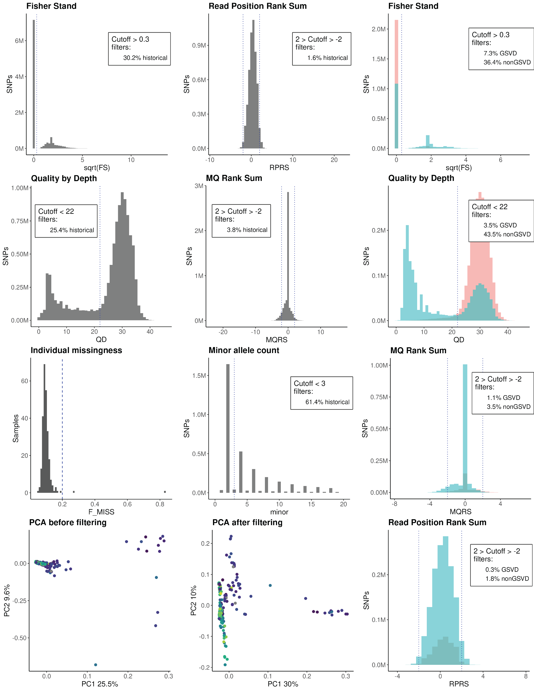

# Historical European *A. thaliana* DNA processing
## Test VCF filters on pseudo-aged high-quality *A. thaliana*

To determine if our variant call filters were appropriate for our historical DNA sequencing, we generated pseudo-aged variants and compared them to natural variants in high fidelity A. thaliana accessions based on the methods in Latorre et al 2022.  We used long-read Nanopore sequenced genome assemblies of contemporary A. thaliana accessions from Lian et al. 2024 (downloaded on 9/20/2024 from NCBI project PRJNA1033522). Thank you Sergio Latorre and Hernán Burbano for your advice and suggestion to use this approach.

| Name | Source |
| ----------- | ----------- |
| config.yaml | [code/config_pseudoage.yaml](../code/config_pseudoage.yaml) |
| gatk-haplotypecaller.py | [code/gatk-haplotypecaller.py](../code/gatk-haplotypecaller.py) |
| get_genotypes_from_VCF.py          | [https://github.com/Burbano-Lab/rice-blast-variant-calling/tree/main/scripts/](https://github.com/Burbano-Lab/rice-blast-variant-calling/tree/main/scripts/) |
| compare_short_vs_long_genotypes.py | [https://github.com/Burbano-Lab/rice-blast-variant-calling/tree/main/scripts/](https://github.com/Burbano-Lab/rice-blast-variant-calling/tree/main/scripts/) |

### Convert hiqh-quality *A. thaliana* to short-"aged" reads
Extract fragmentation log-normal distribution from our samples
```R
library(fitdistrplus)

df <- frags %>% 
  filter(sample == "sample") %>%
  select(bp_length, freq)

# Handle frags weird data format
df_expanded <- df %>%
  rowwise() %>%
  mutate(repeated_values = list(rep(bp_length, freq))) %>%
  unnest(repeated_values) %>%
  select(repeated_values)

# Calculate log-normal distribution
df<-fitdistr(df_expanded$repeated_values, "lognormal")

print(df)

# Confirm output lines up with extracted distribution
curve(dlnorm(x, meanlog=4.06007, sdlog=3.719686e-01 ), from=0, to=300)

```

Run Gargammel to pseudo-age assembled genomes with our target coverage, fragment distribution, and damage
```bash
gargammel.pl -c 9 --comp 0,0,1 --loc  4.06007 --scale  0.3719686 -mapdamage sample_misincorporation.txt double -o assembled_genome/output/ assembled_genome/
```

Before running Grenepipe, put gatk-haplotypecaller.py into grenepipe/workflow/scripts and then in grenepipe/workflow/rules/calling-haplotypecaller.smk, in rule call_variants, change the following lines:
```
    wrapper:
        "0.51.3/bio/gatk/haplotypecaller"
```
to
```
    script:
        "../scripts/gatk-haplotypecaller.py"
```
Map onto *A. thaliana* TAIR10 with Grenepipe. 
```bash
# Make all the sample tables for the run
./generate-table.py assembled_genome/output/ /path/to/grenepipe/output_pseudo/gargamel_samples.tsv

# Use new config with GATK flags that allow for calling on non-variant sites
cp config_pseudoage.yaml /path/to/grenepipe/output_pseudo/config.yaml

# Run grenepipe
snakemake \
    --conda-frontend mamba \
    --conda-prefix /path/to/grenepipe/output/conda-envs \
    --executor slurm \
    --profile /path/to/grenepipe/workflow/profiles/slurm/ \
    --directory /gpath/to/grenepipe/output_pseudo/
```

### Call variants from long-read assemblies
Map assemblies onto TAIR10
```bash
minimap2 -x asm5 -a /path/to/ref/TAIR10_chr_all.fa $assembled_genome1.fa | samtools sort - > $assembled_genome1.bam
```

Call variants
```bash
bcftools mpileup -I -f guy11.fa $assembled_genome1.bam | python3 get_genotypes_from_VCF.py --long /dev/stdin | gzip > $assembled_genome1.long_read_genotypes.gz
```

### Compare "short-read" and long-read variants
```bash
bcftools concat $pseudoaged_genome1.Chr*.g.vcf.gz | python3 get_genotypes_from_VCF.py --short $pseudoaged_genome1.all.g.vcf.gz | gzip > $spseudoaged_genome1.short_read_genotypes.gz
python3 compare_short_vs_long_genotypes.py $pseudoaged_genome1.short_read_genotypes.gz $assembled_genome1.long_read_genotypes.gz 2> $sample1.summary.txt | gzip > $sample1.short_vs_long_compared.gz

# All matching positions
zcat $sample*.short_vs_long.compared.gz | awk '($3 == "A" || $3 == "B")' | sort | uniq | gzip  > matching_positions.gz
# Matching SNPs
zcat $sample*.short_vs_long.compared.gz | awk '$3 == "B"' | sort | uniq | gzip  > GSVD.gz
# All mismatching positions
zcat $sample*.short_vs_long.compared.gz | awk '($3 == "C" || $3 == "D")' | sort | uniq | gzip > nonGSVD.gz
```

Calculate variant calling stats on them
```bash
bcftools view -R compared/GSVD.gz genotyped-all.vcf.gz  | gzip > joint_GSVD.vcf.gz
bcftools query joint_GSVD.vcf.gz -f '%CHROM\t%POS\t%FS\t%SOR\t%MQRankSum\t%ReadPosRankSum\t%QD\t%MQ\t%DP\n' > GSVD.tsv
bcftools view -R compared/nonGSVD.gz genotyped-all.vcf.gz  | gzip > joint_nonGSVD.vcf.gz
bcftools query joint_nonGSVD.vcf.gz -f '%CHROM\t%POS\t%FS\t%SOR\t%MQRankSum\t%ReadPosRankSum\t%QD\t%MQ\t%DP\n' > nonGSVD.tsv
```

Visualize with R
```R
library(tidyverse)

df_gsvd<- read_tsv('GSVD.tsv',
                    col_names = c('chrom','pos','FS','SOR','MQRS','RPRS','QD','MQ','DP'), 
                    na = c('','NA','.')) %>% 
                    mutate(type = 'gsvd')

df_nongsvd<- read_tsv('nonGSVD.tsv',
                    col_names = c('chrom','pos','FS','SOR','MQRS','RPRS','QD','MQ','DP'), 
                    na = c('','NA','.')) %>% 
                    mutate(type = 'non_gsvd')
                    
df <- rbind(df_gsvd, df_nongsvd)

# Plot FS (GATK recommends removing >60)
# df %>% 
#   ggplot(aes(FS, fill=new_col)) +
#   geom_histogram(position = "identity",binwidth = 2, alpha = 0.5) +
#   scale_y_log10()+
#   theme_bw()

cutoff = 0.3
lbl <- df %>% 
  drop_na(FS) %>% 
  dplyr::group_by(type) %>% 
  dplyr::summarise(removed = sum(FS > 0.09) * 100 / n()) %>% 
  pull(removed) %>% 
  round(digits = 1)

df %>% 
  ggplot(aes(sqrt(FS), fill=type)) +
  geom_histogram(position = "identity",binwidth = .2,alpha = 0.5) +
  geom_vline(xintercept = cutoff, color ='blue', linetype="dotted")+ 
  scale_fill_discrete(labels=c(paste0(as.character(lbl)[1],'% GSVD'), paste0(as.character(lbl)[2],'% nonGSVD'))) +
  scale_y_continuous(label = unit_format(unit = "M", scale = 1e-6, sep = "")) +
  labs(y = 'SNPs', fill = paste0('Cutoff > ',as.character(cutoff),'\n','filters:'), title = 'Fisher Stand') +
  theme_classic()+
  theme(aspect.ratio=1,
        axis.text = element_text(size = 12),
        axis.title = element_text(size = 14),
        plot.title = element_text(size = 16, face = 'bold'),
        legend.text = element_text(size = 12),
        legend.title = element_text(size=14),
        legend.position = c(0.80, 0.75),
        legend.box.background = element_rect(color = "grey20", linewidth = 1),
        legend.key = element_blank()) +
  guides(fill = guide_legend(override.aes = aes(label = "", fill = NA, size = NA)))

plot_file_path <- '/path/to/plots/erberich_data_qc_'
ggsave(filename = paste0(plot_file_path, 'FS_gsvd.png'),
       dpi = 300,
       width = 200,
       height = 200,
       scale = 7,
       units = "px",
)

# Plot MQ
cutoff = 40
lbl <- df %>% 
  group_by(type) %>% 
  summarise(removed = sum(MQ < cutoff ) *100 / n()) %>% 
  pull(removed) %>% 
  round(digits = 1)

df %>% 
  ggplot(aes(MQ, fill=type)) +
  geom_histogram(binwidth = 1, position = "identity", alpha = 0.5) +
  theme_bw() +
  geom_vline(xintercept = cutoff, color ='blue', linetype="dotted")+ 
  scale_fill_discrete(labels=c(paste0(as.character(lbl)[1],'% GSVD'), paste0(as.character(lbl)[2],'% nonGSVD'))) +
  scale_y_continuous(label = unit_format(unit = "M", scale = 1e-6, sep = "")) +
  labs(y = 'SNPs', fill = paste0('Cutoff > ',as.character(cutoff),'\n','filters:'), title = 'Mapping Qualtiy') +
  theme_classic()+
  theme(aspect.ratio=1,
        axis.text = element_text(size = 12),
        axis.title = element_text(size = 14),
        plot.title = element_text(size = 16, face = 'bold'),
        legend.text = element_text(size = 12),
        legend.title = element_text(size=14),
        legend.position = c(0.80, 0.75),
        legend.box.background = element_rect(color = "grey20", linewidth = 1),
        legend.key = element_blank()) +
  guides(fill = guide_legend(override.aes = aes(label = "", fill = NA, size = NA)))
ggsave(filename = paste0(plot_file_path, 'FS_gsvd.png'),
       dpi = 300,
       width = 200,
       height = 200,
       scale = 7,
       units = "px",
)
```

### Visualization of VCF QC

*First two columns contain metrics and statistics from this collection of herbarium A. thaliana samples. Third column contains metrics from “in-silica aged” samples compared with long-read sequenced counterparts used to validate cutoffs used on our collection. Gold standard variant dataset (GSVD) consists of variants that are alternatives in the high quality dataset and the “in-silica aged” dataset (“true-positives”). Non-gold standard variant dataset (nonGSVD) consists of variants where there is discrepancy between the high quality dataset and the “in-silica aged” dataset (“false positives” and “false negatives”) Histogram of Fisher strand (FS) scores across variants called from our dataset. FS cutoff of 0.09 (square root of FS is 0.3) removes 30.2% of variants in herbarium specimens. FS cutoff in contemporary samples removes only 7.3% of GSVD and 36.4% of nonGSVD suggesting that filtering on the strand bias is helpful in eliminating erroneous variants caused by short-read sequencing and aging.Histogram of read position rank sum–a metric of positional bias in either alternative or reference calls. Cutoff of +-2 only removes a small portion of sites. Histogram of quality by depth of variant samples. Cutoff of 22 removes less supported calls and 25.4% of herbarium variants. It also removes only 3.5% of GSVD and 43.5% of nonGSVD highlighting its role in removing erroneous variants introduced by short-read sequencing or aging. Histogram of mapping quality rank sum–a metric of mapping quality bias in either alternative or reference calls. Cutoff of +-2 only removes a small portion of sites. Filtering samples with more than 20% of their genome missing removes two samples. Histogram of minor allele count. Even periodicity is indicative of A. thaliana’s homozygous byproduct of being selfing. Cutoff of 3 removes 61.4% of SNPs and leaves only SNPs conserved across at least two samples. Principal component analysis plots of the genetic diversity within the herbarium collection before and after applying the hard filters.
*